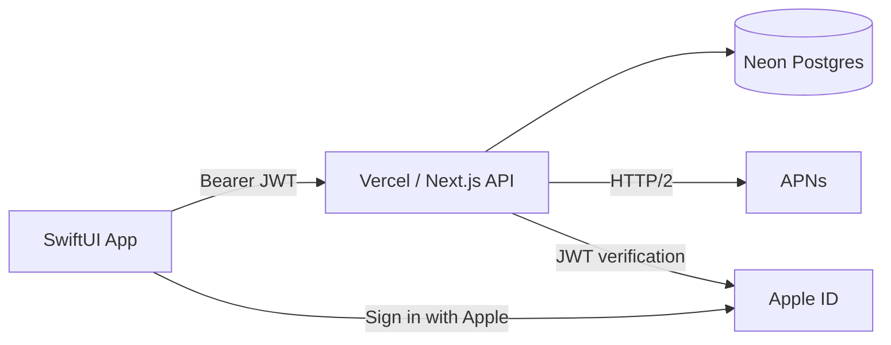

# iOS Full-Stack Starter

A production-ready GitHub template for building iOS apps with a SwiftUI frontend and a Next.js API backend on Vercel. Ships with Sign in with Apple, APNs push notifications, Neon Postgres, and a reference Items CRUD example demonstrating the full stack.

## Architecture



| Layer | Technology |
|---|---|
| iOS App | SwiftUI (Swift Playgrounds `.swiftpm`) |
| API | Next.js 14 App Router on Vercel |
| Database | Neon Postgres (serverless) |
| Auth | Sign in with Apple + Device ID fallback |
| Push | APNs via direct HTTP/2 (no third-party service) |
| CI/CD | GitHub Actions (lint, typecheck, migrate, TestFlight, release) |

## Prerequisites

- **Node.js 20+** and npm
- **Swift Playgrounds** (iPad or Mac) or **Xcode** (Mac)
- **Apple Developer Program** membership ($99/year) — required for Sign in with Apple and push notifications
- A **[Vercel](https://vercel.com)** account
- A **[Neon](https://neon.tech)** account (free tier works)

## Quick Start

### 1. Create your repo

Click **"Use this template"** → **"Create a new repository"** on GitHub.

### 2. Set up the backend

```bash
# Install dependencies
npm install

# Install Vercel CLI
npm i -g vercel

# Link to your Vercel project
vercel link

# Pull the Vercel-provided Neon connection string
vercel env pull .env

# Run database migrations
npm run migrate:up
```

### 3. Configure environment variables

Copy `.env.example` to `.env` and fill in:

| Variable | Where to get it |
|---|---|
| `DATABASE_URL` | `vercel env pull` or Neon dashboard |
| `DATABASE_URL_UNPOOLED` | Neon dashboard (direct connection) |
| `JWT_SIGNING_SECRET` | `openssl rand -base64 32` |
| `APPLE_CLIENT_ID` | Apple Developer → Identifiers → Service ID |
| `APPLE_TEAM_ID` | Apple Developer → Membership |
| `APNS_KEY_ID` | Apple Developer → Keys |
| `APNS_TEAM_ID` | Same as `APPLE_TEAM_ID` |
| `APNS_PRIVATE_KEY` | The `.p8` file contents (single line, `\n` for newlines) |
| `APNS_BUNDLE_ID` | Your app's bundle identifier |
| `CRON_SECRET` | `openssl rand -base64 32` |

### 4. Set up the iOS app

1. Open `YourApp.swiftpm` in Swift Playgrounds (or `open YourApp.swiftpm` in Xcode)
2. In Project Settings, set your Team ID, app icon, and accent color
3. Update the `bundleIdentifier` in `Package.swift` to match your App Store Connect record
4. In `APIClient.swift`, update the `baseURL` to your Vercel deployment URL
5. Run the app — it will auto-authenticate via device ID

### 5. Deploy

```bash
# Deploy to Vercel
vercel --prod

# Set production environment variables
vercel env add JWT_SIGNING_SECRET production
vercel env add APPLE_CLIENT_ID production
# ... (repeat for all env vars)
```

## Project Structure

```
├── app/api/                  # Next.js API routes
│   ├── auth/apple/           # Sign in with Apple
│   ├── auth/device/          # Device ID auth (dev fallback)
│   ├── devices/              # APNs token registration
│   ├── analytics/events/     # Client event ingestion
│   ├── internal/cron/        # Vercel Cron job handlers
│   └── items/                # ★ Reference CRUD example
├── lib/
│   ├── auth.ts               # JWT sign/verify + requireAuth
│   ├── apple.ts              # Apple identity token verification
│   ├── apns.ts               # APNs push via HTTP/2
│   ├── db.ts                 # Neon serverless + pooled connections
│   ├── http.ts               # ApiError, json(), errorResponse()
│   ├── cron.ts               # Vercel Cron secret guard
│   └── items.ts              # ★ Items CRUD helpers
├── migrations/               # node-pg-migrate migrations
├── scripts/migrate.mjs       # Migration runner
├── YourApp.swiftpm/          # iOS Swift Playgrounds app
│   └── AppModule/
│       ├── Networking/       # APIClient, KeychainTokenStore
│       ├── Models/           # Item model (★ reference)
│       ├── ViewModels/       # SessionStore, ItemsViewModel
│       ├── Views/            # SignInView, ItemsView, SettingsView
│       ├── Push/             # PushNotificationManager
│       ├── Analytics/        # AnalyticsQueue
│       └── Theme/            # ThemeStore, colors
└── .github/workflows/
    ├── ci.yml                # Lint + typecheck on PRs
    ├── migrate.yml           # Run DB migrations on push to main
    ├── testflight.yml        # Build + upload to TestFlight
    └── release-swiftpm.yml   # Zip + publish SwiftPM on tags
```

## Customizing for Your App

1. **Rename the app**: Replace `YourApp` in `Package.swift`, all `.swiftpm` directory references, and CI workflow `working-directory` paths
2. **Change the bundle ID**: Update `bundleIdentifier` in `Package.swift` and `com.example.yourapp` in `testflight.yml`
3. **Add your models**: Replace `Item` in `Models.swift` with your own types, create corresponding `lib/*.ts` backend helpers and `app/api/` routes
4. **Customize the UI**: Replace `ItemsView` and `SettingsView` with your own screens
5. **Set up Sign in with Apple**: Configure the entitlement in Xcode (requires a provisioning profile), then switch `SignInView` to use `signInWithApple()` instead of `signInWithDevice()`

## GitHub Secrets

For CI/CD workflows, add these to **Settings → Secrets and variables → Actions**:

| Secret | Used by |
|---|---|
| `DATABASE_URL_UNPOOLED` | `migrate.yml` |
| `APPLE_TEAM_ID` | `testflight.yml`, `release-swiftpm.yml` |
| `APPLE_KEY_ID` | `testflight.yml` |
| `APPLE_ISSUER_ID` | `testflight.yml` |
| `APPLE_PRIVATE_KEY` | `testflight.yml` |
| `DIST_CERT_BASE64` | `testflight.yml` |
| `DIST_KEY_BASE64` | `testflight.yml` |
| `DIST_PROFILE_BASE64` | `testflight.yml` |

## License

MIT — see [LICENSE](./LICENSE).
