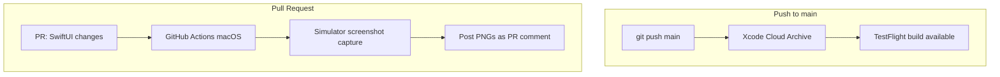

# CI/CD: TestFlight + Screenshots

## Architecture

| Pipeline | Runner | Trigger | Notes |
|---|---|---|---|
| **TestFlight** | Xcode Cloud (Archive) | Push to main | Required: Apple only allows Xcode Cloud (not API keys) to auto-create App Store distribution profiles |
| **Screenshots** | GitHub Actions (`macos-latest`) | PR touching SwiftUI files | Simulator build, no signing needed |

## Why Xcode Cloud for TestFlight?

Apple restricts App Store distribution profile creation to Xcode Cloud and
Admin-authenticated Xcode. API keys — even with App Manager role — get
`Cloud signing permission error` when trying to export for App Store
distribution. This is by design, not a configuration issue.

## Prerequisites

- [Apple Developer Program](https://developer.apple.com) membership ($99/year)
- Xcode on a Mac (one-time, for Xcode Cloud workflow creation)

### App Store Connect Record

Already created: `com.example.yourapp` (SKU: `com.example.yourapp`)

---

## Xcode Cloud Setup (one-time, in Xcode on Mac)

1. Open the project: `open YourApp.swiftpm`
2. **Report Navigator** (⌘9) → Xcode Cloud tab → **Create Workflow**
3. Name: `YourApp CI`
4. Configure:
   - **Primary Repository**: your GitHub repo
   - **Workflow Type**: On push to main
   - **Actions**: Archive
   - **Archive**: ✓ Upload to App Store Connect → TestFlight
   - **Automatically manage signing**: ✓

### Environment Variables

| Variable | Value |
|---|---|
| `APPLE_TEAM_ID` | Your Apple Team ID |

`ci_post_clone.sh` uses this to fill in `Package.swift`'s blank `teamIdentifier`.

---

## GitHub Secrets

For the screenshots workflow (`.github/workflows/xcode-cloud-screenshots.yml`):

| Secret | Value |
|---|---|
| `APPLE_TEAM_ID` | Apple Developer Team ID |

No App Store Connect API keys needed — simulator builds don't require signing.

---

## Files

| File | Role |
|---|---|
| `YourApp.swiftpm/ci_scripts/ci_post_clone.sh` | Sets `APPLE_TEAM_ID` before Xcode Cloud build |
| `SwiPebaby.swiftpm/AppModule/Utilities/ScreenshotCapture.swift` | Mock data, 5 screenshot screens, PNG capture |
| `SwiPebaby.swiftpm/AppModule/SwiPebabyApp.swift` | Detects `--screenshots`, routes to catalog |
| `.github/workflows/xcode-cloud-screenshots.yml` | macOS build + simulator screenshots + PR comment |
| `.github/workflows/release-swiftpm.yml` | Zip .swiftpm for GitHub Releases |

## Cost

- Xcode Cloud: **25 compute hours/month free** with Apple Developer Program
- GitHub Actions macOS: ~8 min per screenshot run; public repos get generous free minutes
